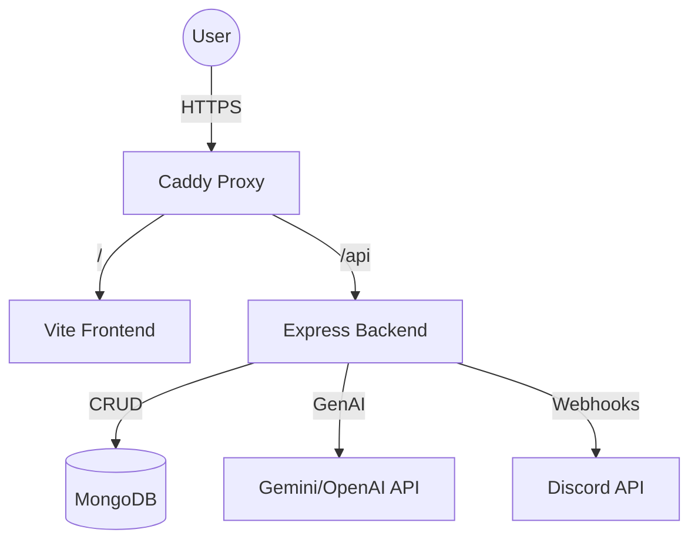

⚔️ Task Slayer
================================

**Project Title:** Task Slayer
**Team Members:**Riyad RahmanMustafa Ugur KurtAnthony TommasoEthan Waldo
**Stack:** MERN (MongoDB, Express, React, Node.js)

1\. Problem Statement
---------------------

Motivation for academic and personal growth is often difficult to maintain because the rewards are abstract and delayed. Students struggle to study or exercise because the feedback loop is too slow. Traditional productivity tools (checklists) feel like chores rather than achievements.

2\. Proposed Solution
---------------------

**Task Slayer** is a **Multiplayer Gamified Progression Engine** that re-contextualizes productivity as a "Monster Battler" game.Instead of "creating tasks," users "summon monsters" that represent their real-world obstacles. Completing the real-world action deals damage to the monster. The application utilizes RPG mechanics (Class Affinities, Gold Economy, Co-op Battles) to provide immediate dopamine feedback for productive behavior.

_Note: This is not a scheduler/calendar. It is a state-progression game driven by user input._

3\. Core Features (MVP)
-----------------------

### 🎮 The Battle System (Task Execution)

*   **Summoning:** Users input a real-world obstacle (e.g., "Calculus Exam"). The system generates a Monster entity (e.g., "The Logic Demon") with HP and a Time Limit.
    
*   **Combat:** Real-world effort translates to in-game Damage. If the user fails to complete the action before the timer expires, the Monster attacks the user (Loss of HP).
    

### 🛡️ The 4 Class Archetypes (Affinity System)

Users choose a class that defines their playstyle and grants damage bonuses against specific types of "Monsters" (Habits).

1.  **The Warrior (Strength)**
    
    *   **Focus:** Health & Vitality (Gym, Sleep, Water).
        
    *   **Bonus:** Deals 1.5x Damage to "Physical" monsters.
        
    *   **Color Theme:** Red.
        
2.  **The Scholar (Intellect)**
    
    *   **Focus:** Wisdom & Logic (Studying, Coding, Reading).
        
    *   **Bonus:** Deals 1.5x Damage to "Mental" monsters.
        
    *   **Color Theme:** Blue.
        
3.  **The Bard (Charisma)**
    
    *   **Focus:** Social & Spirit (Networking, Clubs, Events).
        
    *   **Bonus:** Deals 1.5x Damage to "Social" monsters.
        
    *   **Color Theme:** Green.
        
4.  **The Monk (Discipline)**
    
    *   **Focus:** Chores & Routine (Laundry, Cleaning, Budgeting).
        
    *   **Bonus:** Deals 1.5x Damage to "Chore" monsters.
        
    *   **Color Theme:** Yellow.
        

### 💰 The Economy (Rewards)

*   **Gold System:** Defeating monsters grants Gold.
    
*   **The Shop:** Users can spend Gold on visual upgrades (Avatars, Borders) or Consumables (Potions to restore HP).
    

### 🤝 Social Mercenaries (Co-op)

*   **Parties:** Users can form parties to tackle "Boss" monsters (large projects).
    
*   **Leaderboards:** Competitive ranking based on total Damage Dealt.
    

4\. Technical Stack
-------------------

*   **Frontend:** React.js + Tailwind CSS (Mobile First Design).
    
*   **Backend:** Node.js + Express (REST API).
    
*   **Database:** MongoDB (Mongoose) for flexible Inventory and User State schemas.
    
*   **Infrastructure:** Dockerized container deployment on Linux environment (Raspberry Pi/Cloudflare Tunnel).
    
*   **External APIs:**
    
    *   **OpenAI/Gemini API:** To procedurally generate Monster Names/Flavor Text based on task descriptions.
        
    *   **Discord Webhook:** For "Boss Defeated" notifications.
        

5\. Timeline & Learning Alignment
---------------------------------

_This timeline is structured to align with the course syllabus, ensuring students implement features as they learn the underlying concepts._

**Phase**

**Weeks**

**Syllabus Topic**

**Project Goals**

**Foundation**

1-3

Git, Docker, HTML

**Repo & Design:** Setup GitHub repo, configure Docker/Raspberry Pi environment. Design Figma mockups for Dashboard and Shop.

**Static UI**

4-6

CSS, Flexbox, Tailwind

**Visuals First:** Build the "Shell" of the app (Monster Cards, Profile Page, Shop Grid) using static HTML/React and Tailwind. No backend logic yet.

**Client Logic**

7-9

JS, DOM, Async/API

**Mock Functionality:** Implement the "Battle Math" in plain JavaScript. Connect to OpenAI/Discord APIs directly from the client to test generation logic.

**Backend Core**

10-12

Node, Express, MongoDB

**Data Persistence:** Build the Express API. Move the "Mock" data to MongoDB. Implement User Auth (Login/Signup) as taught in class.

**Integration**

13-15

React Components

**Full Stack Assembly:** Connect the Frontend (Phase 2) to the Backend (Phase 4). Final polish, mobile testing, and live deployment.

### 5.1 Workforce Strategy: Horizontal Slices

To accommodate the learning curve of the course (where Backend is taught in Week 10), the team will adopt a "Horizontal" workflow rather than strict roles during early phases:

*   **Weeks 4-6 (Static UI Phase):** All team members act as **Frontend Developers**. Everyone builds the visual components (HTML/Tailwind) for their assigned features using hardcoded/mock data.
    
*   **Weeks 10-12 (Backend Core Phase):** All team members act as **Backend Developers**. Everyone builds the API endpoints and Database Schemas for their assigned features, replacing the mock data from the previous phase.
    
*   **Weeks 13-15 (Integration Phase):** Team members connect their specific Frontend components to their specific Backend APIs.
    

6\. Project Architecture
-----------------------

### Directory Structure

```text
task-slayer/
├── .github/
│   └── workflows/
│       └── deploy.yml          # CI/CD pipeline (Person D)
├── client/                     # Frontend (React + Vite)
│   ├── src/
│   │   ├── components/         # Reusable UI (Person B)
│   │   ├── pages/              # View logic (Dashboard, Shop, etc.)
│   │   └── assets/             # Images/Styles
│   ├── Dockerfile
│   └── package.json
├── server/                     # Backend (Express + Node)
│   ├── src/
│   │   ├── models/             # Mongoose Schemas (Person C)
│   │   ├── routes/             # API Endpoints
│   │   ├── services/           # AI & Logic (Person D & A)
│   │   └── server.js           # Entry point
│   ├── Dockerfile
│   └── package.json
├── docker-compose.yml          # Orchestration (Person D)
├── Caddyfile                   # Reverse Proxy & SSL (Person D)
└── README.md                   # Project Docs
```

### Flow Diagram



7\. Team Roles & Responsibilities
---------------------------------

The team follows a "Feature Ownership" model. Each member is responsible for the Database, API, and UI components of their assigned features.

### 🧙‍♂️ Person A: The Game Engine (Logic Lead)

*   **Focus:** Backend Logic & Profile Management.
    
*   **Feature Ownership:**
    
    *   **Profile Page:** Full-stack implementation of the User Profile, including Class Selection UI and Stats display.
        
    *   **Class Affinity Logic:** Writing the backend algorithms for damage multipliers (e.g., Warrior deals bonus damage to Physical monsters).
        
    *   **Battle Math:** Implementing the calculateDamage() utility functions.
        

### 🎨 Person B: The Battlefield (Frontend Lead)

*   **Focus:** UI/UX, Animations, & Shop System.
    
*   **Feature Ownership:**
    
    *   **Dashboard (Battlefield):** Building the main responsive grid where "Monster Cards" are displayed. Implementing attack animations/feedback.
        
    *   **Shop System:** Full-stack implementation of the Item Shop (Frontend Grid + Backend Transaction Logic).
        
    *   **Mobile Responsiveness:** ensuring the application meets the responsive requirements on all pages.
        

### 🗄️ Person C: The Data & Auth (Data Lead)

*   **Focus:** Security, CRUD, & Inventory.
    
*   **Feature Ownership:**
    
    *   **Authentication:** Full-stack implementation of JWT Login/Register forms and middleware.
        
    *   **Monster Management:** Creating the forms for "Summoning" (creating) monsters and the backend API routes for storing them.
        
    *   **Schema Design:** Defining the core Mongoose schemas for Users, Monsters, and Inventory.
        

### 🚀 Person D: The Summoner (DevOps & AI Lead)

*   **Focus:** Infrastructure, Deployment, & External Integrations.
    
*   **Feature Ownership:**
    
    *   **Production Infrastructure:** Configuring the Raspberry Pi, Cloudflare Tunnel, and Nginx for public deployment.
        
    *   **Dockerization:** Writing and maintaining the Dockerfile and docker-compose.yml.
        
    *   **AI Integration:** Writing the backend service that connects to OpenAI/Gemini to procedurally generate Monster names.
        
    *   **Leaderboard:** Full-stack implementation of the Leaderboard page and aggregation API.